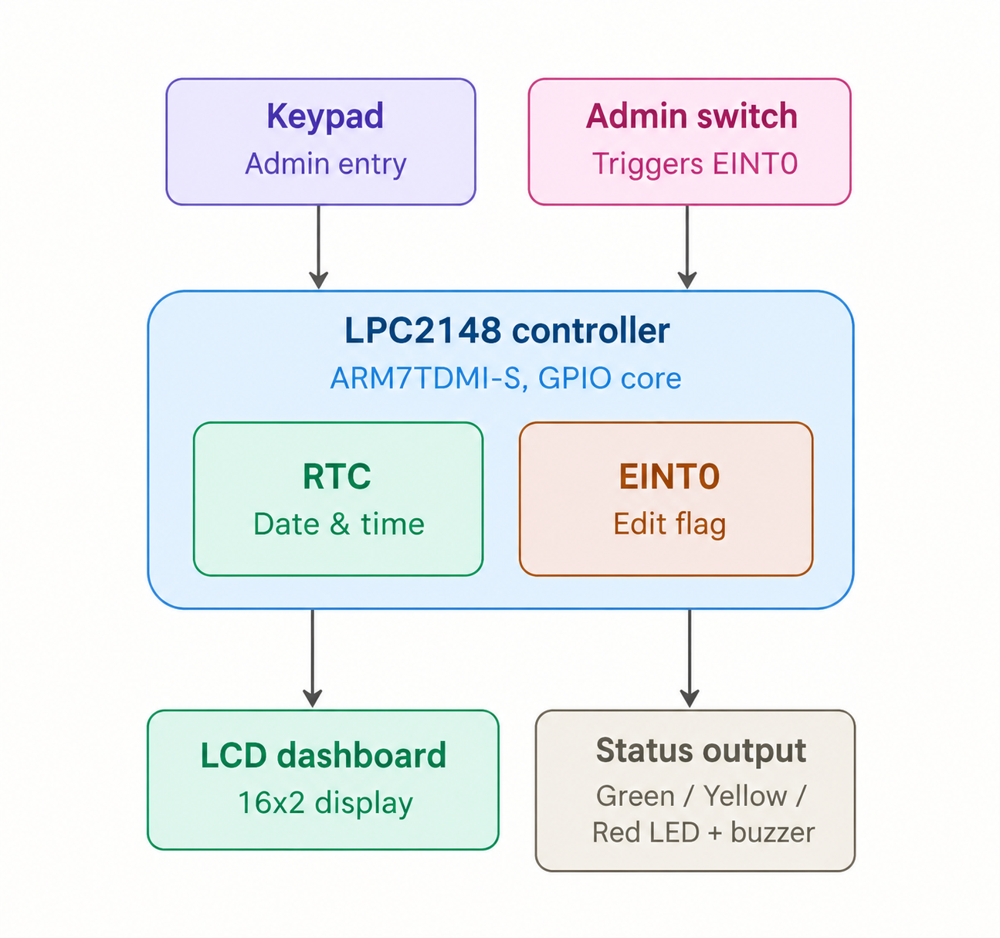

Smart-Railway-Platform-Announcement-System

📖 Table of Contents

- 📌 Project Overview
- 🎯 Objectives
- 🖼️ Block Diagram
- 🏗️ System Architecture
- ⚙️ Hardware Requirements
- 💻 Software Requirements
- 📂 Repository Structure
- 🖥️ LCD Output Gallery
- ✨ Features
- ▶️ Build Instructions
- 📈 Future Enhancements
- 👤 Author

📌 Project Overview

This project implements a **Smart Railway Platform Clock & Announcement Controller** on an **LPC2148 (ARM7TDMI-S)** microcontroller.The system automatically manages train schedule monitoring, real-time clock synchronization, delay indication, and passenger information display — reducing manual station-announcement effort and improving the accuracy of passenger information.

The controller continuously compares the **on-chip RTC** time against a stored **train schedule database** and automatically updates the LCD dashboard, status LEDs, and buzzer without requiring operator intervention. An administrator can pause normal operation at any time (via an interrupt-driven edit switch) to correct the RTC or amend a train's schedule using a 4×4 matrix keypad, then resume live monitoring — **no system restart required**.

🎯 Objectives

- ✅ Display the current date and time obtained from the RTC on the LCD
- ✅ Allow train schedule entry/editing using a 4×4 matrix keypad
- ✅ Store multiple train arrival and departure timings
- ✅ Continuously compare the RTC time with the scheduled train timings
- ✅ Automatically display the upcoming train information on the LCD
- ✅ Indicate train delays by comparing scheduled vs. updated timings
- ✅ Provide LED indications representing train status (On-Time, Approaching, Delayed)
- ✅ Allow authorized editing of train schedules through the keypad
- ✅ Automatically update the platform display based on the RTC
- ✅ Reduce manual intervention and improve passenger information accuracy

🖼️ Block Diagram

🏗️ System Architecture

| Module | Function |
|--------|----------|
| RTC Driver | Maintains and reports current date/time |
| LCD Driver | Renders passenger dashboard and admin screens |
| Keypad Driver | 4×4 matrix scan for admin entry |
| EINT0 Driver | Interrupt-driven admin-edit switch |
| LED/Buzzer Driver | Visual + audible status indication |
| Train Database | In-memory schedule table |
| Project Logic | Next-train selection and dashboard logic |

⚙️ Hardware Requirements

| Hardware | Quantity | Purpose |
|---|---|---|
| LPC2148 | 1 | Main Controller |
| 16×2 LCD | 1 | Passenger Dashboard |
| 4×4 Matrix Keypad | 1 | Admin Schedule/RTC Entry |
| LEDs (Green/Yellow/Red) | 3 | Train Status Indication |
| Buzzer | 1 | Audible Alert |
| Admin-Edit Push Button | 1 | Triggers EINT0 config mode |
| USB-UART Converter / DB-9 Cable | 1 | Flashing / Debug |

💻 Software Requirements

| Software | Purpose |
|---|---|
| Keil µVision | Development / Build |
| Embedded C | Programming |
| Flash Magic | Programming the LPC2148 |

📂 Repository Structure

Smart-Railway-Platform-Clock-Announcement-Controller/

├── Images/                    
├── types.h                     
├── GPIO_defines.h             
├── delays.c / delays.h         
├── RTC.c / RTC.h               
├── LCD.c / LCD.h                
├── KEYPAD.c / KEYPAD.h           
├── EINT.c / EINT.h              
├── LED_BUZZER.c / LED_BUZZER.h  
├── TrainDB.c / TrainDB.h        
├── project_functions.c / .h     
├── MAIN.c                       
├── Startup.s                   
└── README.md

✨ Features

- ✅ Real-time RTC-based clock display
- ✅ Automatic train schedule monitoring & switching
- ✅ Three-tier LED status system (On-Time / Approaching / Delayed)
- ✅ Buzzer alert when a train is approaching
- ✅ Interrupt-driven admin configuration mode (EINT0)
- ✅ Keypad-based train schedule editing (arrival/departure)
- ✅ Keypad-based RTC date/time correction
- ✅ Automatic delay computation relative to original schedule
- ✅ Returns safely to the dashboard after admin edits — no restart needed
- ✅ Modular, industry-standard driver structure (one driver per peripheral)

📈 Future Enhancements

- ⏱️ Multiple-day / recurring schedule support (beyond `TOTAL_TRAINS = 3`)
- 🔊 Recorded voice announcements via an audio module (in place of the buzzer)
- 📶 Remote schedule updates over UART/Wi-Fi instead of local keypad entry
- 🗃️ Non-volatile storage (EEPROM) for the train database, surviving power loss
- 🧭 Multi-platform support (several LCD/keypad stations sharing one RTC)
- 🛠️ Admin PIN/password protection before allowing schedule edits
- 📊 Event logging of all delays and admin edits for later review

👤 Author

Visalakshi Ponnada
Embedded Systems | Embedded C | ARM7 | RTC | LCD/Keypad Interfacing

